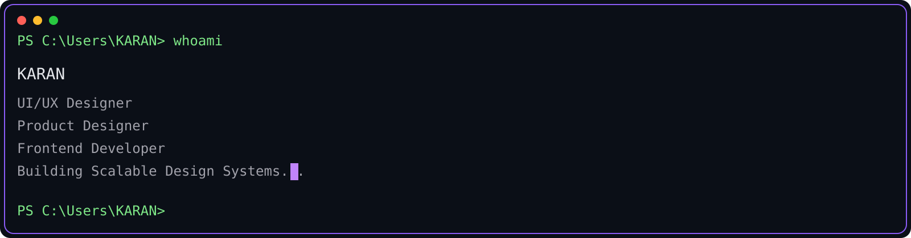

# Hello World! 👋 I'm **Karan Vishwakarma** ✨

> UI/UX Designer & Developer building high-performance web applications and scalable design systems.

<br/>

<div align="center">
  
</div>

<br/>

```bash
karan@github:~$ fastfetch
```

<div align="center">
  
</div>

<br/>

### > Currently Building

```
🛠️ Gametronix E-Commerce Prototype   ████████████████████████████░░  90%
🏛️ VUNO Interior Design Studio        ████████████████████████░░░░░░  80%
⚙️ AI IDE Aggregation Proxy Hub       ███████████████████░░░░░░░░░░░  65%
🎨 Advanced Design Tokens System      ████████████████░░░░░░░░░░░░░░  55%
```

<br/>

### > Stats & Analytics

<div align="center">
  <a href="https://github.com/KaranVish20">
    
  </a>
  <a href="https://github.com/KaranVish20">
    
  </a>
  <a href="https://github.com/KaranVish20">
    
  </a>
</div>

<br/>

### > Tech Stack

<p align="center">
  <a href="https://skillicons.dev">
    
  </a>
</p>

<br/>

### > Recent Activity

- ✔️ **Pushed commits to** [`KaranVish20/Gametronix`](https://github.com/KaranVish20/Gametronix) — Block 04 Checkout Summary
- ✔️ **Completed VUNO Interior Studio** Next.js App Router & Framer Motion Handoff
- ✔️ **Built AI IDE Aggregation Proxy Hub** with Rust/Axum & credit pooling
- ✔️ **Configured Debian Workspace & 109 Skills** synchronization

<br/>

### > Mindset & Creation

<div align="center">
  
</div>

<br/>

### > Connect with me

<p align="center">
  <a href="https://github.com/KaranVish20"></a>
  <a href="https://linkedin.com"></a>
  <a href="https://figma.com"></a>
  <a href="mailto:karan@example.com"></a>
</p>

<br/>

<div align="center">
  
</div>
